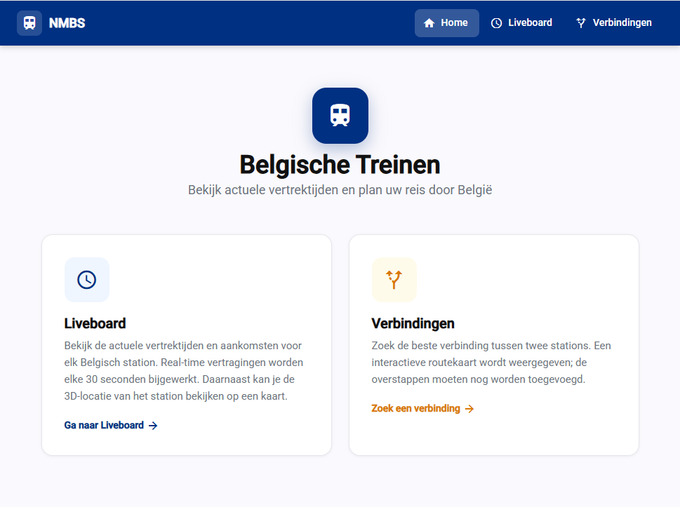
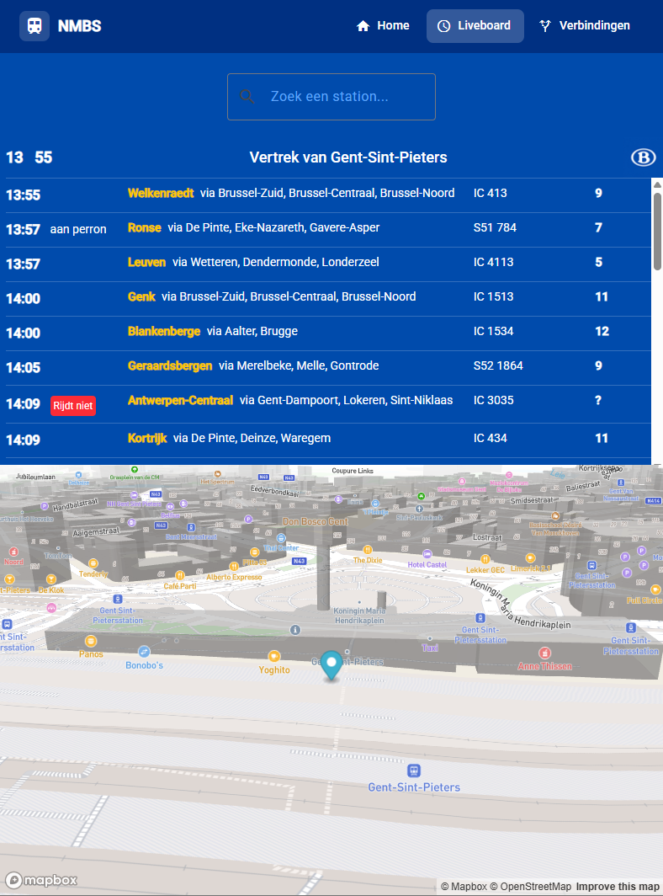
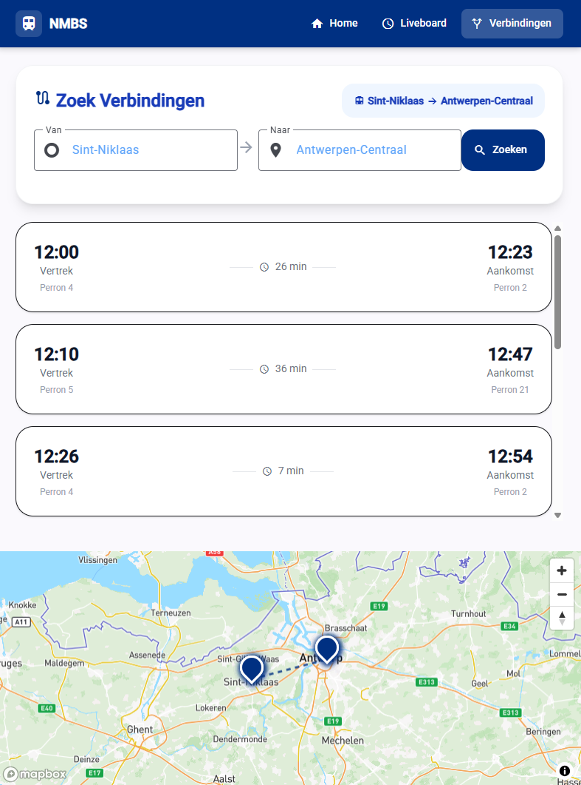

# 🚆 TrainTracker UI

A modern real-time train departure board web application inspired by real European station displays.

---


---

## 🌍 Live Demo

🔗 https://train-tracker-ui-rust.vercel.app

---

## 📸 Preview

| Home | Liveboard | Connections |
|------|----------|-------------|
|  |  |  |

---

## ✨ Features

* 🚉 Live departure board
* 🔄 Auto refresh every 30 seconds
* 🔍 Station search with autocomplete
* 🗺️ Interactive map (Mapbox)
* ⏰ Live clock
* 📱 Responsive design (mobile, tablet, desktop)

---

## 📄 Pages

### 🏠 Home
- Landing page with fast station search
- Quick access to live data
- Clean UI overview

### 🚉 Liveboard
- Real-time departures per station
- Platform, delay and direction info
- Auto-updating schedule every 30 seconds

### 🔗 Connections
- Route planner between stations
- Displays possible train connections
- Useful for trip planning and transfer overview

---

## 🌍 Coverage

### 🇧🇪 Belgium (Full Support)
- Real-time NMBS / iRail API integration
- Accurate live departures
- Platforms, delays, and train info

### 🇫🇷 International (Limited Support)
- Stations like Paris can be searched
- Live departure data may not be available
- Depends on external railway API support

---

## ⚠️ Important Note

This project is primarily focused on **Belgian railway data (NMBS)**.

International stations (e.g. Paris, Amsterdam) are supported for search and navigation purposes, but **real-time departure information is not guaranteed outside Belgium**.

---

## 🛠️ Tech Stack

* Angular
* Tailwind CSS
* Mapbox GL JS

---

## 📂 Project Structure

```
src/
├── app/
│   ├── core/                          # Core layer (singleton services)
│   │   ├── interceptors/              # HTTP interceptors (auth, error handling)
│   │   └── services/                  # Global services (API, utils)
│   │
│   ├── features/                      # Feature-based modules
│   │   ├── connections/               # Route planner / connections feature
│   │   │   ├── components/
│   │   │   │   └── map/
│   │   │   ├── models/
│   │   │   ├── pages/
│   │   │   │   └── connections/
│   │   │   └── services/
│   │   │
│   │   ├── home/                      # Landing page feature
│   │   │   └── pages/
│   │   │       └── home/
│   │   │
│   │   └── liveboard/                 # Real-time departures feature
│   │       ├── components/
│   │       │   └── map/
│   │       ├── models/
│   │       ├── pages/
│   │       │   └── liveboard/
│   │       └── services/
│   │
│   ├── shared/                        # Shared reusable layer
│   │   ├── components/
│   │   │   ├── autocomplete/
│   │   │   ├── navbar/
│   │   │   └── progress-bar/
│   │   ├── models/
│   │   └── services/
│   │
│   ├── app.component.ts
│   ├── app.routes.ts
│   ├── app.config.ts
│   └── app.html
│
├── environments/                      # Environment configs (API keys, URLs)
├── styles.css
├── main.ts
└── index.html
```

---

## ▶️ How to Use

1. Type a station name (e.g. **Gen**)
2. Select from autocomplete
3. View live departures
4. Watch the map update automatically

---

## ⚙️ Setup

### Install dependencies

```bash
npm install
```

---

### Run locally

```bash
ng serve
```

App runs on:

```
http://localhost:4200
```

---

## 🔑 Environment Configuration

Create:

```
src/environments/environment.ts
```

```ts
export const environment = {
  api: {
    baseUrl: 'https://traintracker-1.onrender.com/api',
    liveboard: '/liveboard',
    stations: '/stations',
    connections: '/connections'
  },
  mapboxToken: 'YOUR_MAPBOX_TOKEN'
};
```

---

## 🔗 API Integration

### Base URL

https://traintracker-1.onrender.com/api

---

### 🚉 Liveboard

**GET** `/liveboard/{station}`

Example:

```
https://traintracker-1.onrender.com/api/liveboard/Sint-Niklaas
```

Response:

```json
{
  "stationName": "Sint-Niklaas",
  "latitude": 51.171472,
  "longitude": 4.142966,
  "rows": [
    {
      "directionName": "Antwerpen-Centraal",
      "departureTime": "2026-05-04T08:00:00+00:00",
      "platform": "4",
      "vehicleInfoShortname": "IC 730",
      "delayMinutes": 0
    }
  ]
}
```

---

### 🔍 Stations Search

**GET** `/stations?query={text}`

Example:

```
https://traintracker-1.onrender.com/api/stations?query=Gen
```

Response:

```json
[
  { "name": "Gent-Sint-Pieters" },
  { "name": "Genk" }
]
```

---

### 📄 API Documentation (Swagger)

Interactive API documentation available at:

🔗 https://traintracker-1.onrender.com/swagger

---

## 🚀 Build

```bash
ng build
```

Output:

```
dist/train-tracker-ui
```

---

## 🌐 Deployment

Deployed using:

* Vercel

---

## ⚠️ Notes

* Backend may sleep (free tier on Render)
* First request may take a few seconds
* Mapbox token is required

---

## 🔮 Future Improvements

* ⚡ Real-time updates using SignalR
* 🧠 Smart caching
* 📱 PWA support
* 🎨 UI animations

---

## 🔗 Related

Backend API:
https://traintracker-1.onrender.com

Backend repository:
https://github.com/adelalrafiq/TrainTracker

---

## 👨‍💻 Author

**Adel Al-Rafiq** 🚀
Full Stack Developer  
